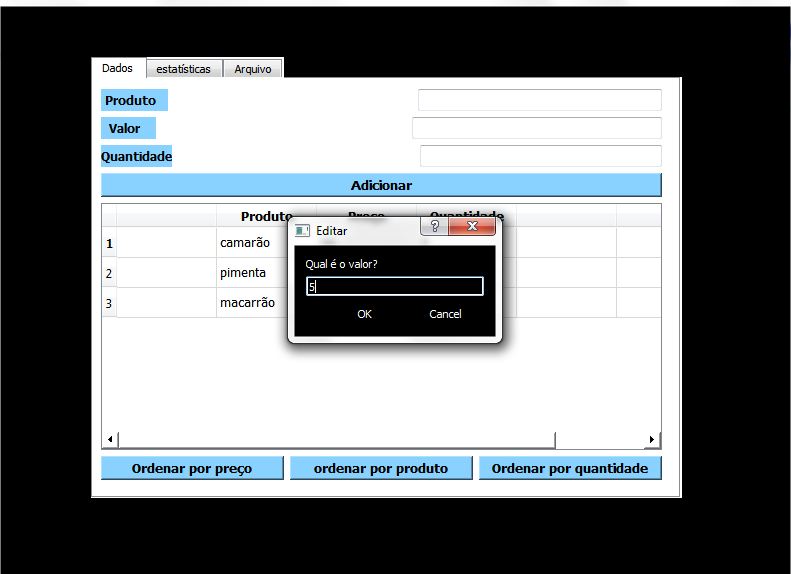

# Projeto_ListaDeCompras
A aplicação "Lista de compras", realizada no Qt creator e com linguagem C++, permite que o usuário faça uma lista de compras inserindo na tabela (tableWidget)os dados da compra a ser efetuada, tais como: o nome do produto, seu preço e quantidade. Após preencher os dados, o usuário vai ter retorno do valor total do consumo, o valor do item mais caro e do mais barato. A "lista de compras" tem como objetivo facilitar o cálculo do consumo, organizar a tabela por ordem alfabetica dos produtos, de preços e de quantidade, e disponibilizando a opção de salvar os dados da compra. 
## Como fazer o login
A figura a seguir mostra a tela "login" do programa. Nessa tela, o usuario deve inserir no campo username a palavra "ifpb" e no local senha a palavra "engenharia".

## Iniciando nova lista

Após fazer o login, o usuario vai abrir uma janela que oferece um pushbutton para iniciar uma nova lisa.

## Inserindo os dados na tabela

Ao abrir uma nova lista de compras, o usuario deve inserir as informações necessárias no campo do "produto","valor" e "quantidade" e clicar no botão "adicionar" ou na tecla enter. Os dados serão inseridos na tabela e o usuário pode organizar as informações de acordo com a necessidade, apenas selecionando os botões de ordenar(localizados abaixo da tabela).

## Modificando os valores da tabela

Nessa perspectiva, para editar os dados basta clicar duas vezes no local da tabela que vai ser alterado, vai aparecer um QMessageBox perguntando o novo preenchimento do campo e uma linha para digitar. Assim que as novas informações forem inseridas, o usuario deve clicar em "ok" e no botão de ordenar para ter a nova tabela editada.

##  Estatísticas

Ao clicar na aba "estatística" o usuário vai ter acesso ao valor total da compra efetuada e o preço do produto mais caro e mais barato catalogado na compra.

## Utilizando o arquivo

Para finalizar, o usuario deve acessar a aba "arquivo" e selecionar entre os botões "salvar" e "carregar", para respectiamente, salvar em um arquivo (a ser escolhido) o programa feito e carregar um arquivo. Além disso, a janela dispõe de um pushbutton para fechar o programa, configurado para perguntar se o usuario deseja salvar os dados ou encerrar o programa.

escolhendo o local do arquivo:

## Fim.

